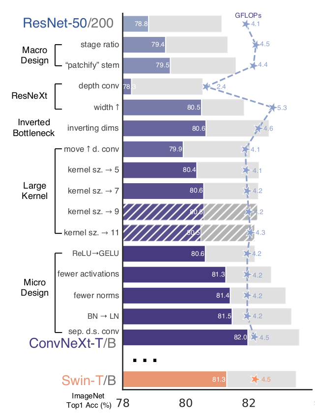

# re-convnext

A **re**-implementation of **ConvNeXt** in PyTorch as described in

[A ConvNet for the 2020s](https://arxiv.org/abs/2201.03545). CVPR 2022.\
[Zhuang Liu](https://liuzhuang13.github.io), [Hanzi Mao](https://hanzimao.me/), [Chao-Yuan Wu](https://chaoyuan.org/), [Christoph Feichtenhofer](https://feichtenhofer.github.io/), [Trevor Darrell](https://people.eecs.berkeley.edu/~trevor/) and [Saining Xie](https://sainingxie.com)\
Facebook AI Research, UC Berkeley

---
## What is this about?
The [official repository](https://github.com/facebookresearch/ConvNeXt) contains the final version of the model (dubbed ConvNeXt) after all the modernizing steps described in the paper, whereas we provide a standalone model for each checkpoint (macro design, resnext, inverted bottleneck, etc.).

This repository mainly serves an introductory and educational purpose as we document the implementation progression from ResNet to ConvNeXt in PyTorch.

## Explanation
Here is the *modernizing roadmap* from the original paper:



There are 7 checkpoints in the implementation roadmap: ResNet, Macro Design, ResNeXt, Inverted Bottleneck, Large Kernel, Micro Design (ConvNeXt).

The implementations are in `models` folder in the following order:

- We started with [torchvision's ResNet](https://pytorch.org/vision/0.8/_modules/torchvision/models/resnet.html), simplified it to [`resnet.py`](models/resnet.py), integrate stochastic depth in [`resnet_stodepth.py`](models/resnet_stodepth.py).

- Added the macro changes described in the paper, resulting in [`macro_changes.py`](models/macro_changes.py).

- Added the ResNeXt-like changes described in the paper, resulting in [`resnextify.py`](models/resnextify.py).

- Added inverted bottleneck in [`inverted_bottleneck.py`](models/inverted_bottleneck.py).

- Moved depthwise conv. up and use larger kernel in [`large_kernel.py`](models/large_kernel.py).

- Added micro-design in [`micro_design.py`](models/micro_design.py). This is already equivalent to ConvNeXt.

- Cleaned up the code to get the final checkpoint in [`convnext.py`](models/convnext.py).

In each checkpoint, the changes made with respect to the previous checkpoint, except for [`convnext.py`](models/convnext.py), are documented in the code in `NOTE` comments, e.g.

```py
# NOTE: Inverted bottleneck
expand_width = planes * self.expansion
self.conv1 = conv1x1(inplanes, expand_width)
self.n1 = norm_layer(expand_width)
self.conv2 = conv3x3(expand_width, expand_width, stride, depthwise=True)
self.n2 = norm_layer(expand_width)
self.conv3 = conv1x1(expand_width, planes)
self.n3 = norm_layer(planes)
```

## References
- [The ConvNeXt paper](https://arxiv.org/abs/2201.03545) which this implementation is based on.
- [The official implementation](https://github.com/facebookresearch/ConvNeXt), where we double checked to make sure the final checkpoint [`convnext.py`](models/convnext.py) is equivalent to ConvNeXt.
- [Torchvision's resnet](https://pytorch.org/vision/0.8/_modules/torchvision/models/resnet.html).
